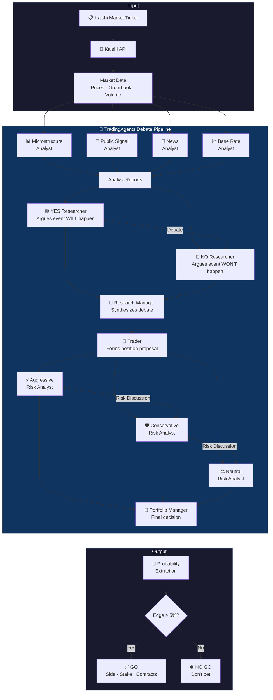
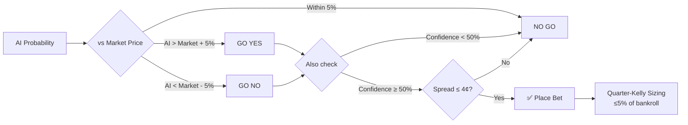

# KalshiPredictionAgent

A multi-agent **buy / no-buy prediction platform** for [Kalshi](https://kalshi.com) event-contract markets, powered by [TradingAgents](https://github.com/TauricResearch/TradingAgents) and the GitHub Copilot LLM proxy.

Drop in any Kalshi market — sports, politics, economics, crypto — and a panel of AI agents debates the question, then tells you whether to bet and how much.


> ⚠️ **Research / paper-trading only.** This tool analyzes markets and recommends bets but **never places orders**. Not financial advice.

---

## How It Works



### The Pipeline Step by Step

| Step | Agent | What It Does |
|------|-------|-------------|
| 1 | **Microstructure Analyst** | Reads Kalshi orderbook, spread, volume, price action |
| 2 | **Public Signal Analyst** | Assesses market consensus and external signals |
| 3 | **News Analyst** | Searches for recent news affecting the outcome |
| 4 | **Base Rate Analyst** | Grounds the estimate in historical data and precedent |
| 5 | **YES Researcher** | Builds the strongest case that the event WILL happen |
| 6 | **NO Researcher** | Builds the strongest case that it WON'T happen |
| 7 | **Research Manager** | Reads both sides, picks a direction with evidence |
| 8 | **Trader** | Translates the research into a concrete position |
| 9 | **Risk Team** (3 agents) | Aggressive, conservative, and neutral analysts debate risk |
| 10 | **Portfolio Manager** | Makes the final call |
| 11 | **Probability Extraction** | Distills everything into P(YES) and confidence |
| 12 | **Sizing Engine** | Fractional Kelly criterion → stake amount |

### Decision Logic



---

## Features

- 🏠 **Web Dashboard** — Streamlit UI with market browser, live progress, and signal history
- 📋 **Market Browser** — Filter by category (Sports, Politics, Economics, Crypto, etc.) or keyword search
- 🤖 **Multi-Agent Debate** — 10+ AI agents powered by TradingAgents framework
- 📊 **Live Progress** — Watch each agent work in real-time with expandable console
- 💰 **Kelly Sizing** — Conservative quarter-Kelly position sizing with safety caps
- 📜 **Signal History** — Every prediction logged with Brier score calibration tracking
- 🔴 **Read-Only** — Analyzes markets but never places orders

---

## Quick Start

### Prerequisites

- Python 3.11+
- Node.js (for copilot-api proxy)
- GitHub Copilot Pro/Pro+ subscription

### 1. Install

```bash
git clone https://github.com/bbabcock1990/KalshiPredictionAgent.git
cd KalshiPredictionAgent
python -m venv .venv

# Windows
.\.venv\Scripts\Activate.ps1

# macOS/Linux
source .venv/bin/activate

pip install -e ".[dev]"
```

### 2. Start the LLM Proxy

```bash
# Install (one-time)
npm install -g copilot-api

# Start (authenticates via browser on first run)
copilot-api start
```

### 3. Launch the Dashboard

```bash
# In a new terminal
kalshi-agents web
```

Open **http://localhost:8501** in your browser.

### 4. Configure Settings

1. Go to ⚙️ **Settings** in the sidebar
2. Select a model from the dropdown (e.g., `gpt-4o-mini` for fast, `gpt-4o` for better quality)
3. Set your paper bankroll
4. Click **💾 Save Settings**

### 5. Run Your First Signal

1. Go to 🏠 **Dashboard**
2. Type a ticker (e.g., `KXFEDDECISION-28JAN-H0`) or browse by category
3. Click **🔍 Fetch Market** to see the market card
4. Click **🚀 Run Agent Signal** and watch the agents debate (1-2 minutes)

---

## CLI Usage

```bash
# Fetch market data (no LLM needed)
kalshi-agents market KXFEDDECISION-28JAN-H0

# Run full agent signal
kalshi-agents signal KXFEDDECISION-28JAN-H0 --bankroll 5000

# JSON output for scripting
kalshi-agents signal KXFEDDECISION-28JAN-H0 --json

# Debug mode (see agent debate)
kalshi-agents signal KXFEDDECISION-28JAN-H0 --debug

# Launch web dashboard
kalshi-agents web
```

---

## Project Structure

```
KalshiPredictionAgent/
├── src/kalshi_agents/
│   ├── cli.py                     # CLI entry point
│   ├── config.py                  # App configuration
│   ├── kalshi/
│   │   ├── client.py              # Kalshi REST client (read-only)
│   │   └── models.py              # Market & Orderbook dataclasses
│   ├── agents/
│   │   ├── kalshi_graph.py        # TradingAgents adapter + event-market analysts
│   │   ├── tools.py               # Kalshi tools + TA news tools
│   │   └── base.py                # AgentReport type
│   ├── decision/
│   │   └── sizing.py              # Kelly criterion sizing engine
│   ├── storage/
│   │   └── db.py                  # SQLite calibration logger
│   └── web/
│       ├── app.py                 # Streamlit dashboard
│       └── settings_store.py      # Persistent settings (JSON)
├── tests/
│   ├── test_sizing.py             # Sizing engine + Kelly tests
│   ├── test_kalshi_models.py      # Market model parsing tests
│   └── test_calibration.py        # Calibration store tests
├── pyproject.toml
└── README.md
```

---

## How It Uses TradingAgents

This project is built **on top of** [TradingAgents](https://github.com/TauricResearch/TradingAgents) — the multi-agent trading framework from Tauric Research. We reuse:

| From TradingAgents | How We Use It |
|--------------------|--------------|
| LangGraph agent graph | Same debate → risk → decision flow |
| LLM client factory | Connects to GitHub Copilot, OpenAI, Anthropic, etc. |
| Research Manager / Trader / Portfolio Manager | Reused as-is for decision-making |
| Risk debate (Aggressive / Conservative / Neutral) | Reused as-is for risk assessment |
| `get_news` / `get_global_news` tools | News search via yfinance for event context |

What we **replace** for event markets:

| Stock-Specific | Our Event-Market Version |
|---------------|------------------------|
| Market analyst (price/indicators) | Microstructure analyst (orderbook/spread) |
| Fundamentals analyst (balance sheet) | Base rate analyst (historical frequency) |
| Sentiment analyst (StockTwits/Reddit) | Public signal analyst (consensus/signals) |
| News analyst (company news) | Event news analyst (topic-specific search) |
| Bull / Bear researchers | YES / NO researchers |
| Buy/Sell/Hold output | P(YES) probability + Kelly sizing |

---

## Configuration

Settings are saved to `~/.kalshi-agents/settings.json`.

| Setting | Default | Description |
|---------|---------|-------------|
| `kalshi_env` | `prod` | `prod` for real markets, `demo` for sandbox |
| `llm_provider` | `github-copilot` | LLM provider |
| `llm_model` | `gpt-4o-mini` | Model (dropdown auto-populated from proxy) |
| `bankroll_usd` | `1000` | Paper bankroll for position sizing |
| `max_stake_pct` | `5%` | Maximum % of bankroll per bet |
| `kelly_fraction` | `0.25` | Quarter-Kelly (conservative sizing) |
| `min_edge` | `5%` | Minimum probability edge to trigger GO |
| `min_confidence` | `50%` | Minimum agent confidence to trigger GO |
| `max_spread_cents` | `4¢` | Maximum bid-ask spread |
| `min_minutes_to_close` | `60` | Minimum time before market closes |

---

## Disclaimer

This software is for **research and education only**. It does not constitute financial, investment, or trading advice. The AI agents can and will be wrong. You are solely responsible for any positions you take based on its output. The authors accept no liability for any losses.

---

## License

MIT
